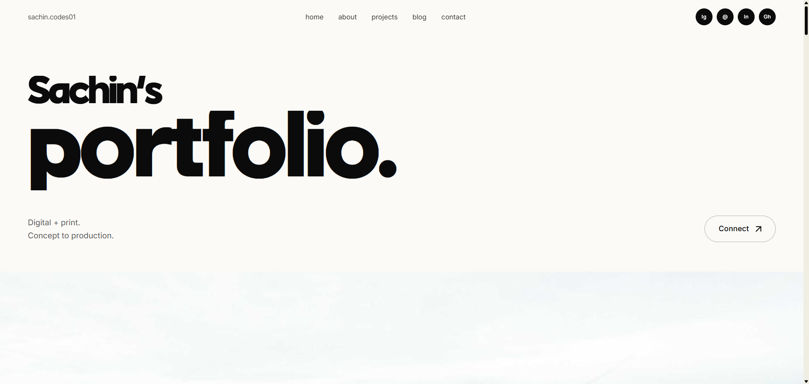

# Sachin's Portfolio

An editorial, single-page developer portfolio built with React 19 and Vite. Content-driven — every piece of copy, every link and every screenshot lives in one data file — with smooth inertial scrolling, scroll-triggered reveals and an interactive project gallery.

## 🌐 Live Demo

🚀 **Live Website:** [https://sachin-codes01-portfolio.netlify.app](https://sachin-codes01-portfolio.netlify.app/)

## 📸 Screenshot

<p align="center">
  
</p>

## Features

### Experience
- Inertial smooth scrolling (Lenis) with anchor navigation from the navbar — automatically disabled when the OS requests reduced motion
- Scroll progress bar pinned to the top of the page
- Scroll-triggered reveal animations, a hero mask-up intro and parallax bands (Motion)
- Interactive project gallery — panels expand on hover, and each project ships three separate crops (open / rest / slim) so the shot stays well framed at every panel width
- Fully responsive layout, checked from phone through desktop
- Local variable fonts (Inter, Archivo) plus a custom display face — no Google Fonts request at runtime
- PWA-ready manifest, favicons and Apple touch icon

### Sections
- **Hero** — stacked display type with an animated intro
- **What I do** — services (web development, app development, video editing) with the stack behind each
- **About** — bio, quick facts (education, location, languages, what I'm open to) and a full tech stack list
- **Projects** — six live projects and repos, plus a closing card linking to the full GitHub profile; one panel serves an APK download straight from `/public`
- **Real person** — the non-CV side, with portrait
- **Process** — brief → design → build → deploy → handover
- **What's included** — what every project ships with
- **FAQ** — accordion of the questions clients actually ask
- **Contact** — validated enquiry form with a success snackbar
- **Work together** — a second, lighter form aimed at other developers, plus social links

## Tech Stack

- **React 19** + **Vite 8**
- **Tailwind CSS v4** — configured entirely in CSS (`src/index.css`), no `tailwind.config.js`
- **Material UI v9** — interactive pieces only (accordion, form fields, buttons, tooltip, dialog, snackbar), themed flat in `src/theme.js` to match the layout
- **Motion** — scroll reveals, hero mask-up, parallax, progress bar
- **Lenis** — inertial scrolling and anchor navigation
- **Fontsource** — Inter + Archivo variable fonts, bundled locally
- **oxlint** — linting

> Tailwind's preflight is the CSS reset. MUI's `CssBaseline` is deliberately **not** mounted so the two don't fight over base styles.

## Project Structure

```text
Portfolio/
├── public/                   # Static assets served as-is
│   ├── fonts/                # Ragick display face (.otf)
│   ├── WPBM.apk              # Downloadable Android build
│   ├── favicon.ico
│   └── site.webmanifest
│
├── src/
│   ├── assets/
│   │   └── projects/         # Project screenshots (open / rest / slim cuts)
│   ├── components/           # One file per section + shared UI
│   │   ├── Hero.jsx
│   │   ├── HowWeWork.jsx
│   │   ├── About.jsx
│   │   ├── Gallery.jsx
│   │   ├── RealPerson.jsx
│   │   ├── Process.jsx
│   │   ├── Included.jsx
│   │   ├── Faq.jsx
│   │   ├── Contact.jsx
│   │   ├── WorkTogether.jsx
│   │   ├── Footer.jsx
│   │   ├── Navbar.jsx
│   │   ├── Reveal.jsx
│   │   └── ScrollProgress.jsx
│   ├── data/
│   │   └── site.js           # All copy, links and image imports
│   ├── lib/
│   │   ├── form.js           # Validators
│   │   ├── useEnquiryForm.js # Shared form state / validation / reset
│   │   └── useSmoothScroll.js
│   ├── App.jsx               # Section order
│   ├── index.css             # Tailwind v4 config, @theme tokens, @font-face
│   ├── main.jsx
│   └── theme.js              # MUI theme
│
├── index.html
└── vite.config.js
```

## Getting Started

### Prerequisites

- Node.js (v18 or later)
- npm

### 1. Clone the Repository

```bash
git clone https://github.com/sachin-codes01/Sachin-Portfolio.git
cd Sachin-Portfolio
```

### 2. Install Dependencies

```bash
npm install
```

### 3. Start the Dev Server

```bash
npm run dev
```

The application will be available at:

```text
http://localhost:5173
```

### Scripts

| Command | What it does |
| --- | --- |
| `npm run dev` | Start the Vite dev server |
| `npm run build` | Production build into `dist/` |
| `npm run preview` | Serve the production build locally |
| `npm run lint` | Run oxlint |

> No environment variables are required — the site is fully static and has no backend.

## Editing Content

Everything readable lives in [`src/data/site.js`](src/data/site.js): nav, socials, services, about copy, project list, process steps, FAQ and footer links. Components read from it, so you rarely need to open a component just to change words.

### Swapping in images

Project screenshots are imported at the top of `src/data/site.js` from `src/assets/projects/`, so Vite fingerprints and optimises them. A few placeholder shots still come from `picsum.photos` via the `img()` helper — replace those with a real import (or a path under `public/`) as you produce them. That file is the only place image sources appear.

### Design tokens

Defined in the `@theme` block in `src/index.css`:

`ink` `paper` `cream` `sand` `clay` `flame` `crimson`, plus the `text-mega` / `text-huge` fluid type steps. Change them there and the whole page follows.

### Fonts

`Ragick` (`public/fonts/ragick.otf`) is the display face — declared once via `@font-face` in `src/index.css` and exposed to Tailwind as `font-display`. Body text uses `font-sans` (Inter); `font-wide` (Archivo) is the small caps / eyebrow face.

## Contact Form

Client-side validation only. `onSubmit` in [`src/components/Contact.jsx`](src/components/Contact.jsx) clears the form and shows a snackbar — there is no backend yet. Point the marked `TODO` at Formspree, Resend, or your own endpoint before shipping.

## Deployment

Deployed on [Netlify](https://www.netlify.com) as a static site.

| Setting | Value |
| --- | --- |
| Build command | `npm run build` |
| Publish directory | `dist` |
| Node version | 18+ |

Because it's a single-page app with hash-based anchors only, no SPA redirect rule is needed. The same build deploys cleanly to Vercel or GitHub Pages.

## Tech Highlights

- React 19 + Vite 8 Build Pipeline
- Tailwind CSS v4 with CSS-First Configuration
- Selective Material UI Integration (No `CssBaseline` Conflict)
- Motion-Powered Scroll Reveals & Parallax
- Lenis Inertial Smooth Scrolling with Reduced-Motion Support
- Hover-Responsive Multi-Crop Project Gallery
- Single-Source-of-Truth Content Layer (`src/data/site.js`)
- Reusable Form Hook with Shared Validation
- Locally Bundled Variable Fonts (No External Font Requests)
- Fully Responsive, Accessible Layout
- PWA Manifest & Full Favicon Set

## Notes

- The production bundle is roughly 627 kB (~200 kB gzipped), most of it Material UI. If that matters, import fewer MUI components or split the vendor chunk in `vite.config.js`.
- Section order lives in [`src/App.jsx`](src/App.jsx).

## License

This project is for personal and educational purposes. Feel free to fork and modify it for learning.

